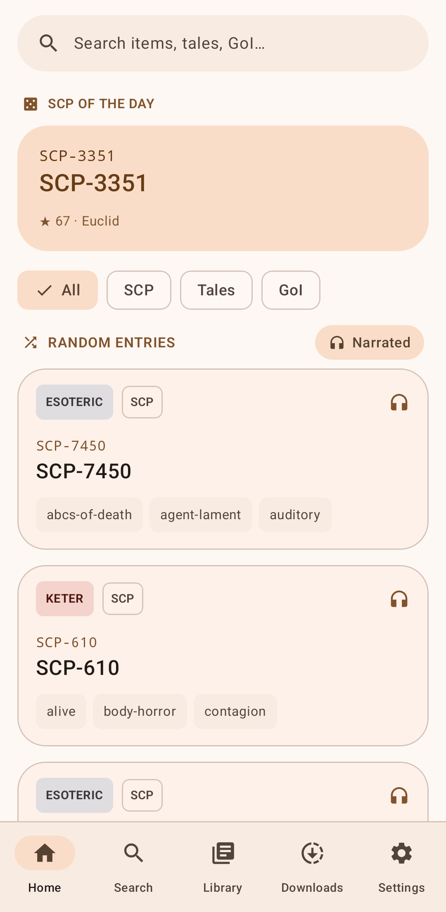
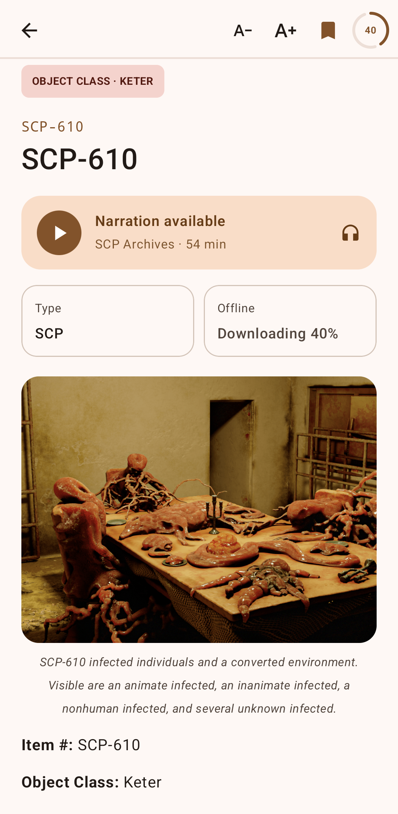
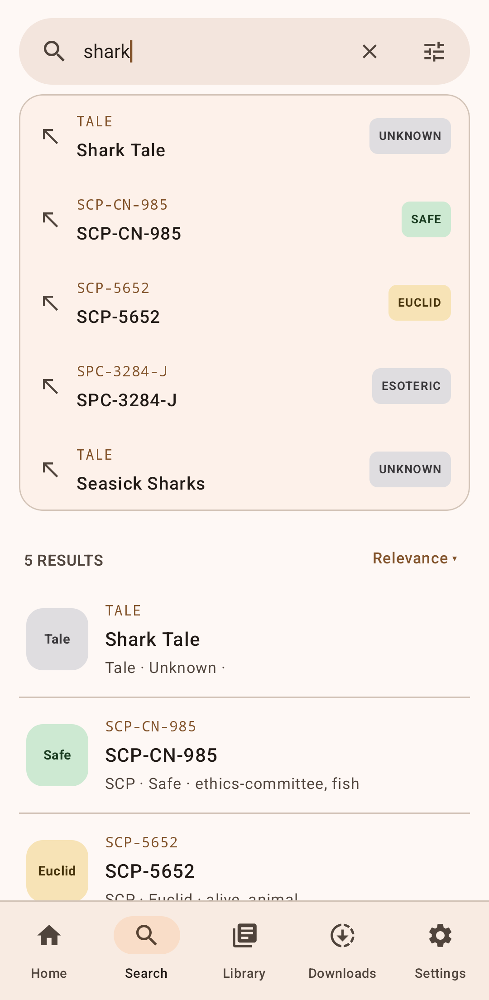
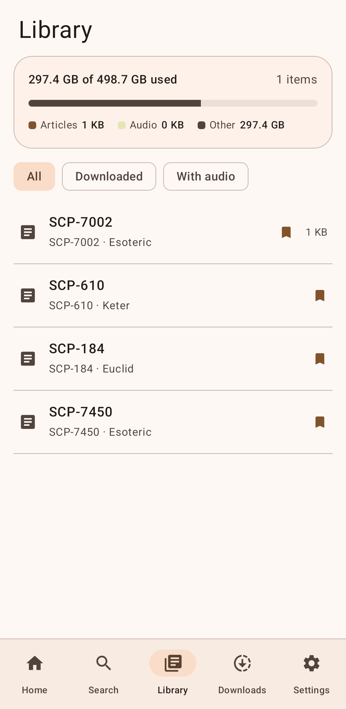
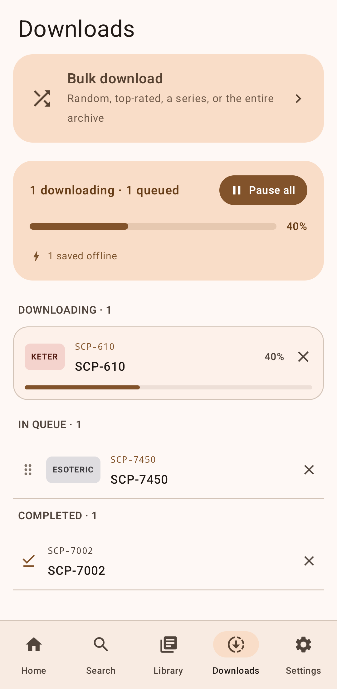

# SCP Reader

An Android app for reading the SCP Foundation wiki. Browse and search the archive,
save articles to read offline, and play the narration when it's available.

> Unofficial — not affiliated with the SCP Foundation. Article text and the emblem
> come from the SCP Wiki and are licensed under CC BY-SA 3.0.

## Features

- Browse the archive with an SCP of the Day highlight and random-entry discovery, filtered by SCP, Tales or GoI
- Full-text search across SCPs, tales and GoI documents, sortable by relevance
- Read articles with rendered collapsibles, redactions and the ACS bar, and follow wiki links inside the app
- Play narration when it's available, with playback tracked per article
- Save articles and narration for offline reading, with a storage breakdown in your library
- Queue and manage downloads — including bulk download of random, top-rated, a series or the entire archive
- Bookmarks and a recently-viewed list
- Adjustable text size, light/dark/auto themes and dynamic color from your wallpaper
- Tune discovery: choose the home highlight and exclude object classes from random picks
- Resumes where you left off

## Screenshots

| Home | Article | Search |
| --- | --- | --- |
|  |  |  |

| Library | Downloads |
| --- | --- |
|  |  |

## Building

You need the Android SDK and JDK 17.

```
./gradlew assembleDebug
```

The APK ends up in `app/build/outputs/apk/debug/`.
