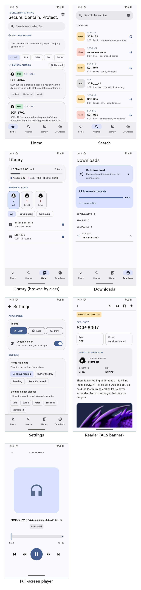

# SCP Reader

An Android app for reading the SCP Foundation wiki. Browse and search the archive,
save articles to read offline, and play the narration when it's available.

## Attribution

- Article text and images are from the [SCP Foundation wiki](https://scp-wiki.wikidot.com), licensed under [CC BY-SA 3.0](https://creativecommons.org/licenses/by-sa/3.0/). The app links back to each article's original wiki page and repeats this attribution in the reader itself.
- The SCP emblem is from [Wikimedia](https://commons.wikimedia.org/), also CC BY-SA 3.0.
- Narration audio is produced by [SCP Archives](https://www.youtube.com/@SCParchives) and sourced from their YouTube videos (with their Apple Podcasts feed as a fallback). The reader links to the specific YouTube video for any article with narration, with credit shown alongside it.

## Screenshots



## Features

- Browse the archive with an SCP of the Day highlight and random-entry discovery, filtered by SCP, Tales, GoI or series
- Read across 19 SCP branches beyond the English wiki, with a prompt to open an article's translation in another branch
- Full-text search across SCPs, tales and GoI documents, with a Top Rated / Recently Viewed zero-state before you type
- Rich reader: rendered collapsibles, tabs, tables, interactive footnotes, redactions, the ACS bar and object-class badges; in-app wiki links; selectable text; and tap an image to view it full-screen and zoom
- Vote on articles — upvote, downvote or clear your vote — with your own Wikidot account
- For articles with bespoke wiki styling, open a "View original theme" web view of the fully-styled page
- Play YouTube-sourced narration in a full-screen player or the system media notification, with SponsorBlock segments (sponsor, intro, outro, filler and more) skipped automatically
- Save articles (with offline images) and ad-free, SponsorBlock-trimmed narration for offline reading and playback, with a storage breakdown and a browse-by-class filter in your library
- Queue and manage downloads — including bulk download of random, top-rated, a series or the entire archive
- Recommend articles to friends and open the recommendations they send you
- Bookmarks and a recently-viewed list
- Adjustable text size, light/dark/auto themes, an AMOLED black theme, and dynamic color from your wallpaper
- Tune discovery: choose the home highlight and exclude object classes from random picks
- Resumes where you left off, and shows a What's New summary after each update
- Checks for new releases and installs updates in-app

## Building

You need the Android SDK and JDK 17.

```
./gradlew assembleDebug
```

The APK ends up in `app/build/outputs/apk/debug/`.
